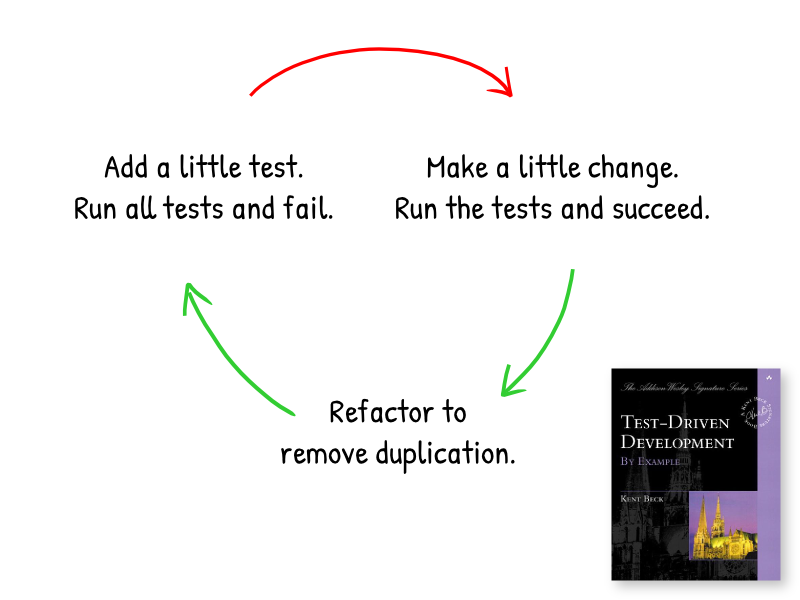
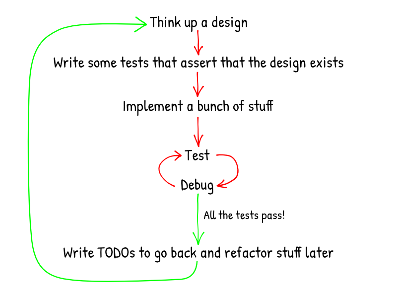

# Test-Driven Development as if you meant it
An exercise for pushing Test-Driven Development to its limits. 
Originally by Keith Braithwaite.

# Test-Driven Development isn't complicated
1. Add a little test
1. Run all the tests and watch the new one fail
1. Make a little change
1. Run all the tests and watch the new one pass
1. Refactor to remove duplication
1. Repeat until done

# But we observe many people doing "Pseudo-TDD"

 # TDD is about detailed feedback on design choices
 
 ### Thinking about solutions is not getting feedback
 ### Feedback comes from tests
 
 ### Therefore
 - Run tests early
   - No, _much_ earlier than that
 - Run tests often
   - No, _much_ more often than that
 

 
